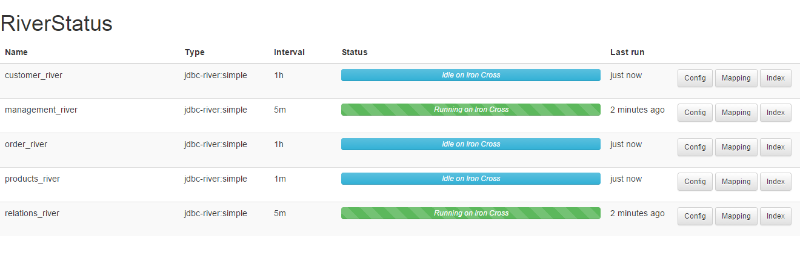

Riverstatus plugin for Elasticsearch
================================
Provides insight about the rivers in your Elasticsearch cluster.

### Features###
* Overview of rivers
* Animated status indication per river

### Supported rivers ###

- Elasticsearch JDBC River (forked) [https://github.com/msimons/elasticsearch-river-jdbc](https://github.com/msimons/elasticsearch-river-jdbc)
- Elasticsearch JDBC River (not tested yet) [https://github.com/jprante/elasticsearch-river-jdbc](https://github.com/jprante/elasticsearch-river-jdbc)




Development
-----------

### Run/debug ###
```shell
mvn install exec:java
```
This will start Elasticsearch on [http://localhost:9200](http://localhost:9200). You can access the plugin by going to [http://localhost:9200/_plugin/riverstatus](http://localhost:9200/_plugin/riverstatus).

Installation
------------

*This plugin is currently in development, no releases have been published yet. If you would like to install the plugin manually, you can do so by getting the build release package (see Development) and run the following command from within your Elasticsearch folder:*

```shell
./bin/plugin --u file:///path/to/plugin.zip --i elasticsearch-riverstatus 
```


